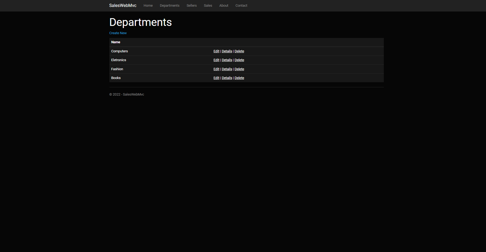
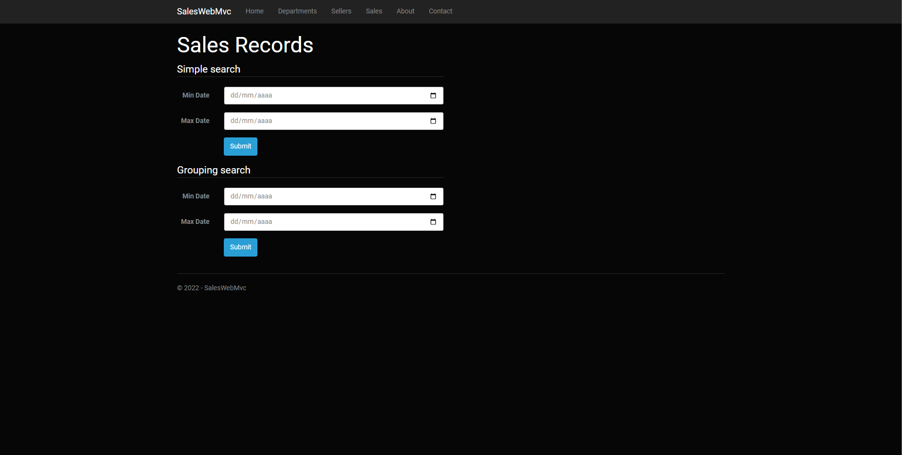
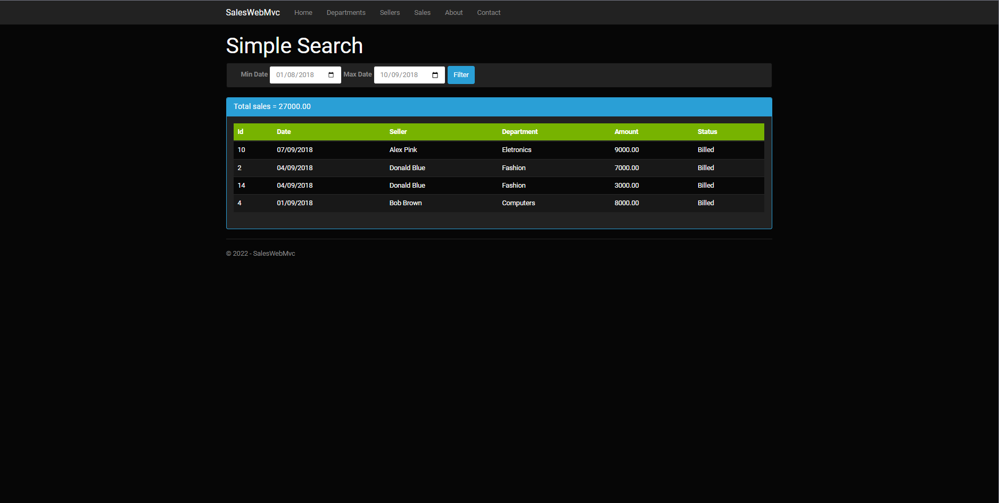
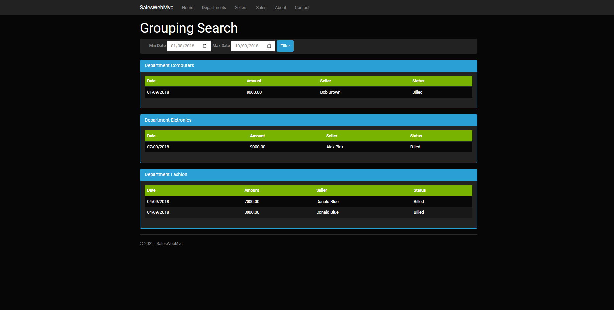

# SalesWebMvc

## Projeto de área restrita contendo vendedores, departamentos e vendas utilizando ASP.NET, criado junto com o professor Nelio Alves do curso: https://www.udemy.com/course/programacao-orientada-a-objetos-csharp/ 

# Projeto
Projeto foi realizado no modelo ASP.NET utilizando Models, Views e Controllers, também foi utilizado conceitos da programação orientada a objetos com o Entity Framework para as conexões/alterações no banco de dados 
Projeto se constitui: <ul>Aba Sellers contendo CRUD dos vendedores</ul>
<ul>Aba de Departments contendo CRUD para os departamentos </ul>
<ul>Aba Sales com CRUD e 2 métodos de busca das vendas: </ul>
<ul>Simple search (Pesquisa simples) </ul>
</ul><ul>Grouping search (Pesquisa agrupada) </ul>
